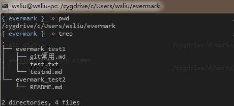
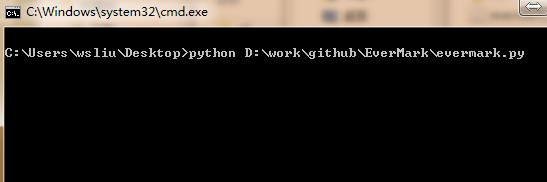
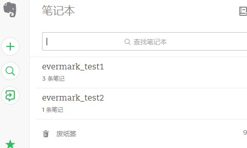
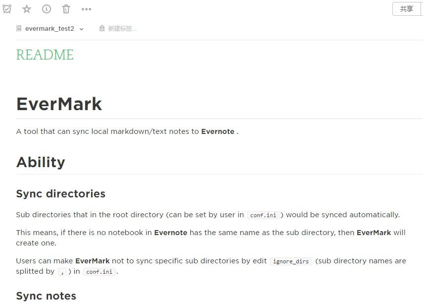

# EverMark
A tool that can sync local markdown/text notes to **Evernote** .

## Ability

### Sync directories

Sub directories that in the root directory (can be set by user in `conf.ini`) would be synced automatically.

This means, if there is no notebook in **Evernote** has the same name as the sub directory, then **EverMark** will create one.

Users can make **EverMark** not to sync specific sub directories by edit `ignore_dirs` (sub directory names are splitted by `,`) in `conf.ini`.

### Sync notes

Only files that have `.txt` or `.md` suffix would be synced to **Evernote** .

`txt` represents plain text files.

`md` represents  **MarkDown** files.

## Workbench structure

**EverMark** can sync a whole directory(root directory of your workbench) to your **Evernote** account.

And the directory contains some sub directories(represents notebooks in your **Evernote** account).

Each sub directory corresponds to a notebook and contains a list of files represent notes in this notebook.

For example, a local workbench like

- root directory
  - sub_directory (named *sub1*)
    - file (named *f1.txt*)
    - file (named *f2.md*)
  - sub_directory (named *sub2*)
    - file (named *f1.md*)
    - file (named *f3.txt*)

would be converted by **EverMark** to **Evernote** note structure:

- your **Evernote** account
  - notebook (named *sub1*)
    - note (named *f1*)
    - note (named *f2*)
  - notebook (named *sub2*)
    - note (named *f1*)
    - note (named *f3*)

## Usage

### Install **EverMark**
**EverMark** is written by **Python**, so firstly make sure that your PC has **Python** installed.

1. Download **EverMark** from ***github***.

2. Unpack it, and move it to anywhere you like.

### Get **Evernote** Developer Token
**EverMark** need a **Evernote** Developer Token to access your account.

So you need to create a **Evernote** Developer Token.

You can refer to [**Evernote** Developer Token page](https://dev.evernote.com/doc/articles/dev_tokens.php) to get a full understand of  **Evernote** Developer Token.

Or you can just go to [Create **Evernote** Developer Token](https://www.evernote.com/api/DeveloperToken.action) or [创建印象笔记Developer Token](https://app.yinxiang.com/api/DeveloperToken.action) if you are user of **印象笔记** , then click ***Create a developer token*** to create your developer token.

Copy the Developer Token after you have created it, and save it carefully(anyone have this token can access your notes in **Evernote** !) .

### Configure **EverMark**

1. Open file `conf.example.ini` in the path that **EverMark** is installed to.

2. Set `auth_token` to the **Evernote** Developer Token you have created.

3. Set `account_type` to `evernote`, or `yinxiang` if you are a **印象笔记** user.

### Run
You can directly execute `evermark.py` in the installed path.

For example, if the path you install **EverMark** is *path_to_evermark*, then you can start **EverMark** by `python path_to_evermark/evermark.py`.

Or you can create a link to `path_to_evermark/evermark.py` and execute it anywhere you like.

The default workbench is `evermark` directory in you `HOME` path.

## Example images

### Workbench

### Start **EverMark**

### Sync result: notebooks

### Sync result: note

